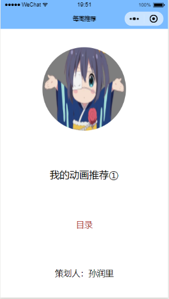
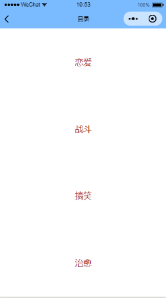
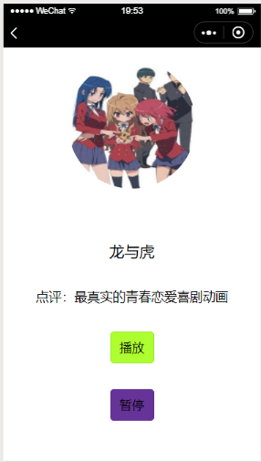

# 
Demo&nbsp;&nbsp;介绍
## 
策划人：孙润里
### 功能介绍
    这是一个简单的微信小程序————《动画推荐》，编写其的目的在于：为使用这个小程序的人推荐不同类型的符合喜好的动画。其介绍内容包含了以下几点：
    1. 目录：列出了不同的动画类型，方便根据自己的喜好进行了解。
    2. 推荐动画的简单信息————动画PV、op、ed等，分在不同的区块，可通过播放、暂停开关便于人观看（目前只实现了音乐的自动播放，不可通过开关控制）。
    3. 我的点评：用一到两句话对此动画进行概括。
    4. 动画链接：给有意观看的人提供播放的链接。
### 如何运行
    请告知我您的微信号，让我添加体验权限以及开发权限。之后使用微信扫描下面二维码即可体验，可使用自己的账号用微信开发者工具打开程序，二维码如下：

### 运行实例
 

    

