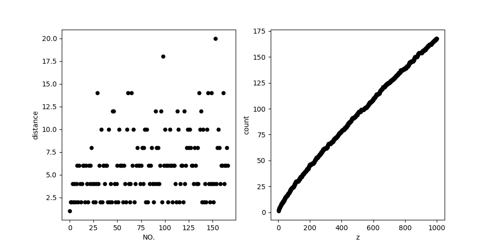
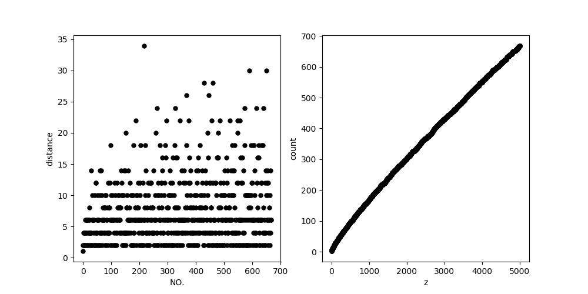
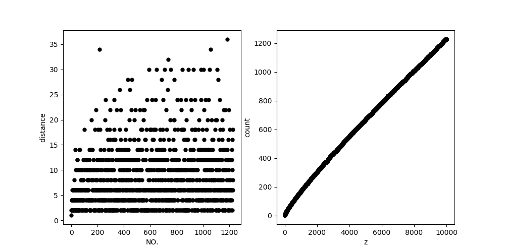

# 郑玥的Demo
## Demo功能
对任意大于2的正整数z，该程序可以计算出不大于z的素数的个数，及相邻两素数间的距离，并绘制出素数个数关于z的分布情况和差值的分布情况。
## 如何运行
运行plot.py即可。
## 运行结果示例
z=1000时结果如下（左图为距离分布，右图为个数分布）

z=5000

z=10000

可以看出，大部分差值都分布在2，4，6之间，随着z增大，距离极大值有增大的趋势。