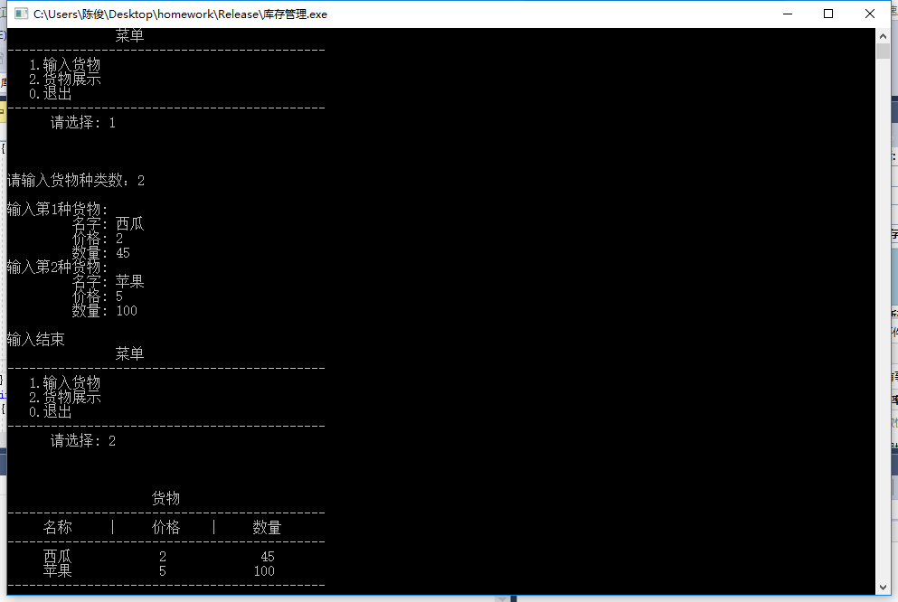

# 陈俊Demo说明
## 功能
     首先确定商品种类数（不超过100），依次输入各种商品的商品名称、商品单价、商品数量。输入完成后可以根据页面提示查看各种商品的价格及数量。
## 运行结果示意图


 ## 商品信息显示程序代码
 ---
```c++
#include "stdafx.h"
#include<iostream>
#include<iomanip>
using namespace std;

int input(char n[][20], int p[], int s[])
{
	int i, num = 0;
	while (num <= 0 || num >= 100)
	{
		cout << "请输入货物种类数：";
		cin >> num;
	}
	cout << endl;
	for (i = 0; i <num; i++)
	{
		cout << "输入第" << i + 1 << "种货物: " << endl;
		cout << "         名字: ";
		cin >> n[i];
		cout << "         价格: ";
		cin >> p[i];
		cout << "         数量: ";
		cin >> s[i];
	}
	cout << endl << "输入结束" << endl << endl;
	return num;
}
void show(int num, char n[][20], int p[], int s[])
{
	int i;
	cout << "                    货物" << endl;
	cout << "--------------------------------------------" << endl;
	cout << "     名称     |     价格    |     数量 " << endl;
	cout << "--------------------------------------------" << endl;
	if (num != 0)
		for (i = 0;i < num;i++)
		{
			cout << setw(9) << n[i] << "    ";
			cout << setw(9) << p[i] << "    ";
			cout << setw(11) << s[i] << endl;
		}
	else
		cout << endl << "            这里什么都没有哦！！！" << endl << endl;
	cout << "--------------------------------------------" << endl<<endl<<endl;
}
int menu()
{
	int choice = 0;
	cout << "               菜单" << endl;
	cout << "--------------------------------------------" << endl;
	cout << "   1.输入货物" << endl;
	cout << "   2.货物展示" << endl;
	cout << "   0.退出" << endl;
	cout << "--------------------------------------------" << endl;
	cout << "      请选择: ";
	cin >> choice;
	cout << endl << endl << endl;
	return choice;
}
int main()
{
	int n = 0, choice;
	int price[100], stock[100];
	char name[100][20];
	while ((choice = menu()) != 0)
	{
		switch (choice)
		{
		case 1:
			n = input(name, price, stock);
			break;
		case 2:
			show(n, name, price, stock);
			break;
		}
	}
    return 0;
} 
```
***